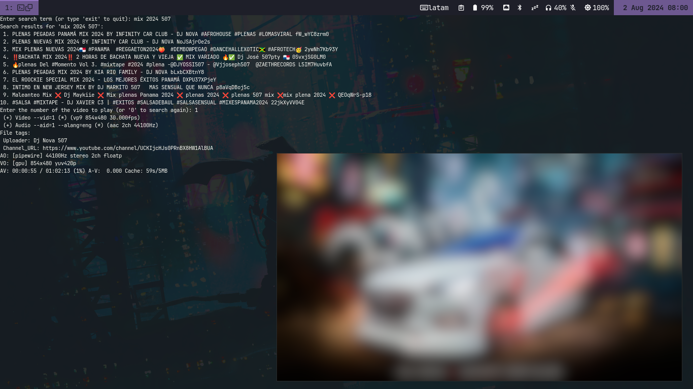

# yt-splay
YT-SPLAY - It is a shell script to Search and Play Youtube videos in terminal.

It is required to install: 
- [**yt-dlp**](https://github.com/yt-dlp/yt-dlp)
- [**mpv**](https://github.com/mpv-player/mpv)

Clone the repository
```
$ git clone https://github.com/hpardo79/yt-splay.git
```

Go to directory
```
$ cd yt-splay
```

Make executable
```
$ chmod +x yt-splay.sh
```

Run
```
$ ./yt-splay.sh
```


When performing the search, it shows the top 10 results.
You can change the resolution of the videos you are looking for; it is set to 480p, you just need to modify the line 68:
```
FORMAT="bestvideo[height=480][ext=mp4]+bestaudio[ext=m4a]/best[height=480][ext=mp4]"
```


